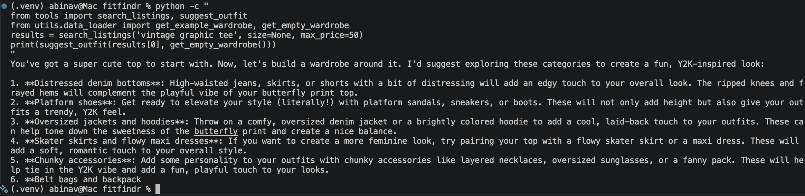

# FitFindr — Starter Kit

This starter kit contains everything you need to begin Project 2.

## What's Included

```
ai201-project2-fitfindr-starter/
├── data/
│   ├── listings.json          # 40 mock secondhand listings
│   └── wardrobe_schema.json   # Wardrobe format + example wardrobe
├── utils/
│   └── data_loader.py         # Helper functions for loading the data
├── planning.md                # Your planning template — fill this out first
└── requirements.txt           # Python dependencies
```

## Setup

```bash
pip install -r requirements.txt
```

Set your Groq API key in a `.env` file (get a free key at [console.groq.com](https://console.groq.com)):
```
GROQ_API_KEY=your_key_here
```

## The Mock Listings Dataset

`data/listings.json` contains 40 mock secondhand listings across categories (tops, bottoms, outerwear, shoes, accessories) and styles (vintage, y2k, grunge, cottagecore, streetwear, and more).

Each listing has: `id`, `title`, `description`, `category`, `style_tags`, `size`, `condition`, `price`, `colors`, `brand`, and `platform`.

Load it with:
```python
from utils.data_loader import load_listings
listings = load_listings()
```

## The Wardrobe Schema

`data/wardrobe_schema.json` defines the format your agent uses to represent a user's existing wardrobe. It includes:

- `schema`: field definitions for a wardrobe item
- `example_wardrobe`: a sample wardrobe with 10 items you can use for testing
- `empty_wardrobe`: a starting template for a new user

Load an example wardrobe with:
```python
from utils.data_loader import get_example_wardrobe
wardrobe = get_example_wardrobe()
```

## Tool Inventory

### Tool 1: search_listings

**Purpose:** Search mock thrift listings by description, size, and price. Returns ranked results by keyword relevance.

**Inputs:**
- `description` (str): Keywords describing what user seeks (e.g., "vintage graphic tee"). Required.
- `size` (str | None): Size filter (e.g., "M", "S/M"). Case-insensitive. None to skip.
- `max_price` (float | None): Maximum price threshold (inclusive). None to skip.

**Outputs:**
List of listing dicts, sorted by relevance (highest first). Each contains: `id`, `title`, `description`, `category`, `style_tags`, `size`, `condition`, `price`, `colors`, `brand`, `platform`. Empty list if no matches.

**Error Handling:** Returns `[]` on no results. Agent checks length and sets error message, returns early without calling downstream tools.

---

### Tool 2: suggest_outfit

**Purpose:** Generate 1–2 outfit suggestions using new item + user's wardrobe, or general styling advice if wardrobe empty.

**Inputs:**
- `new_item` (dict): Listing dict (item user is considering). Must contain: `title`, `price`, `category`, `colors`, `style_tags`, `platform`.
- `wardrobe` (dict): Wardrobe with structure `{"items": [wardrobe_items]}`. Items have: `name`, `category`, `colors`, `style_tags`. May be empty.

**Outputs:**
Non-empty string with outfit suggestion. If wardrobe has items: specific pairings naming wardrobe pieces. If empty: general styling advice (e.g., "pair with jeans and sneakers..."). Always returns text, never empty.

**Error Handling:** Resilient. Empty wardrobe is handled gracefully with general advice, not error.

---

### Tool 3: create_fit_card

**Purpose:** Generate casual Instagram/TikTok caption for outfit + item. Mentions item name, price, platform naturally (once each).

**Inputs:**
- `outfit` (str): Outfit suggestion string from suggest_outfit(). Contains styling context.
- `new_item` (dict): Listing dict. Extracts: `title`, `price`, `platform`, `colors` for caption.

**Outputs:**
String containing 2–4 sentence casual caption (e.g., "Found this vintage band tee for $24 on Depop 🔥 Styled it with my baggy jeans and chunky sneakers — peak '90s energy. obsessed. #thriftfit"). Sounds authentic, not promotional.

**Error Handling:** Defensive guard against empty/whitespace outfit. Returns error message string instead of crashing (e.g., "Could not create fit card: outfit suggestion was empty. Vintage Band Tee is a black/white tops. Try a different search...").

---

## Planning Loop

**8-step sequential execution:**

1. Initialize session dict with query + wardrobe reference
2. Parse query via regex to extract `description`, `size` (or None), `max_price` (or None) → store in `session["parsed"]`
3. Call `search_listings(description, size, max_price)` → store results in `session["search_results"]`
4. **CRITICAL BRANCH:** Check if `session["search_results"]` is empty
   - **Empty:** Set `session["error"]` to user message (e.g., "No vintage graphic tees found under $30. Try adjusting size, price, or search term.") → return session immediately
   - **Has results:** Continue to step 5
5. Select top result (highest relevance) → `session["selected_item"] = session["search_results"][0]`
6. Call `suggest_outfit(selected_item, wardrobe)` → store in `session["outfit_suggestion"]`
7. Call `create_fit_card(outfit_suggestion, selected_item)` → store in `session["fit_card"]`
8. Return completed session dict

**Key invariant:** If search returns empty, steps 6–7 do NOT execute. Error early-exit prevents calling downstream tools with invalid input.

---

## State Management

**Session dict** is single source of truth. All values read from session, all outputs written back to session. No external state modifications.

**Fields:**
- `query` (str): Original user query
- `parsed` (dict): `{description, size, max_price}` extracted from query
- `search_results` (list): Listing dicts from search_listings()
- `selected_item` (dict): Top result from search_results (or None if empty)
- `wardrobe` (dict): User's wardrobe (passed in, not modified)
- `outfit_suggestion` (str): Output from suggest_outfit() (or None if error)
- `fit_card` (str): Output from create_fit_card() (or None if error)
- `error` (str | None): Error message if any step failed. If set, downstream tools not called.

**Flow:**
1. search_listings reads from `session["parsed"]`, outputs → `session["search_results"]`
2. If search returns empty, branch sets `session["error"]` and returns
3. suggest_outfit reads from `session["selected_item"]` + `session["wardrobe"]`, outputs → `session["outfit_suggestion"]`
4. create_fit_card reads from `session["outfit_suggestion"]` + `session["selected_item"]`, outputs → `session["fit_card"]`
5. Caller (app.py) checks `session["error"]` first; if set, returns error to user; otherwise returns all three strings

---

## Error Handling

| Tool | Failure Mode | Concrete Example | Response |
|------|------------|----------|----------|
| search_listings | No results match query | Query: "designer ballgown size XXS under $5" → search_results empty | `session["error"] = "No designer ballgown size XXS found matching your criteria. Try adjusting size, price, or search term."` → return early, fit_card stays None |
| suggest_outfit | Wardrobe is empty | User has 0 wardrobe items, new_item = Y2K Baby Tee | LLM returns general advice: "This Y2K Baby Tee pairs well with baggy jeans, sneakers, or combat boots for a fun, eclectic vibe" (no error) |
| create_fit_card | Outfit string empty/whitespace | outfit = "" or "   " (should not happen in normal flow) | Returns error message: "Could not create fit card: outfit suggestion was empty. Y2K Baby Tee is a white/pink/purple tops. Try a different search or refresh your wardrobe." |

**Error Handling Example:**



---

## Spec Reflection

**What worked:**
- Regex query parsing handles most natural language variants ("under $30", "$30", "size M", "S/M", etc.)
- Session dict pattern enforces clean state flow; no side effects or implicit dependencies
- Early-return on empty search results prevents cascading errors
- LLM temperature tuning (0.8 in create_fit_card) generates varied captions without hallucination

**Testing coverage:**
- Happy path: "vintage graphic tee under $30" → found Y2K Baby Tee ($18), outfit suggestions mention wardrobe items by name, caption includes price/platform
- Error path: "designer ballgown size XXS under $5" → empty search results, error set, downstream tools not called, fit_card remains None

**If rebuilding:**
- Consider LLM-based query parsing for complex/ambiguous queries instead of regex
- Add caching for repeated searches
- Validate item dict fields more strictly before passing to LLM tools
- Test with edge cases: queries with no keywords, extreme prices, uncommon sizes

---

## AI Tool Usage

### Instance 1: Test Suite Generation

**Input given:**
- Tool specs (Tool 1–3 with inputs, outputs, failure modes from planning.md)
- Error Handling section (3 tools × 3 failure modes = 9 test cases)
- Request: Generate pytest test file skeleton with test class per tool, one test per failure mode, placeholder TODOs for assertions

**Output received:**
tests/test_tools.py with 12 tests across 3 classes, each with TODO comment showing what to assert:
- TestSearchListings: 5 tests (description-only, size filter, price filter, no results, relevance sorting)
- TestSuggestOutfit: 3 tests (with wardrobe, empty wardrobe, non-empty return)
- TestCreateFitCard: 4 tests (happy path, empty outfit, whitespace outfit, includes details)

**What I changed:**
- Filled TODOs with actual assertions + sample data (listing dicts, get_example_wardrobe(), get_empty_wardrobe())
- Added load_listings() import (initially omitted)
- Improved assertions to check specific conditions (price threshold, size matching, error message presence, sentence count)

---

### Instance 2: Architecture Diagram (Mermaid)

**Input:** Planning Loop (8 steps + critical branch), State Management (session fields), tool specs

**Output:** Mermaid flowchart showing:
- User input → parse → search_listings
- Decision diamond: "Results empty?" → YES (error, red, early return) / NO (continue)
- suggest_outfit → create_fit_card → return
- State nodes (session.parsed, session.selected_item, etc.) in orange
- Color coding: blue=init, orange=state, red=error, green=success

**What I changed:** Square brackets `session[parsed]` → dot notation `session.parsed` (parser fix). Light colors → dark backgrounds (readability).

---

### Why direct implementation vs. AI generation:

- **Tools (search_listings, suggest_outfit, create_fit_card):** Implemented directly from tool spec (inputs, outputs, failure modes). Regex-based query parsing chosen over LLM-based to avoid circular dependency (don't want agent calling LLM to parse query for another LLM call).
- **agent.py:** Built from Planning Loop spec step-by-step. Used code review agent for validation rather than generation to ensure spec alignment.
- **handle_query (app.py):** 5-step TODO was explicit enough to implement directly; no ambiguity.

**Validation over generation approach:** More confident in correctness when following detailed spec + verifying against it, rather than generating code and retrofitting to spec.
