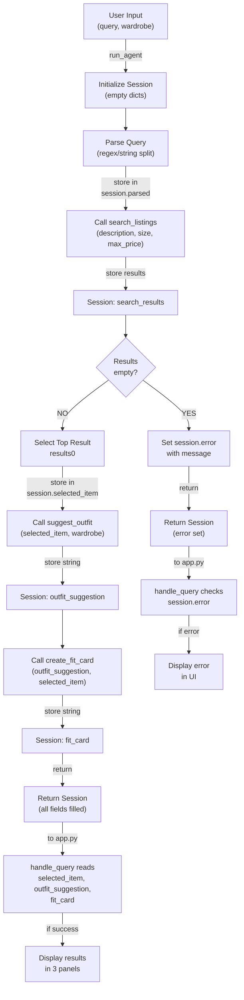

# FitFindr — planning.md

> Complete this document before writing any implementation code.
> Your spec and agent diagram are what you'll use to direct AI tools (Claude, Copilot, etc.) to generate your implementation — the more specific they are, the more useful the generated code will be.
> Your planning.md will be reviewed as part of your submission.
> Update it before starting any stretch features.

---

## Tools

List every tool your agent will use. For each tool, fill in all four fields.
You must have at least 3 tools. The three required tools are listed — add any additional tools below them.

### Tool 1: search_listings

**What it does:**
Searches the mock thrift listings dataset for items matching the user's description. Filters by optional size (case-insensitive matching) and max price. Returns results ranked by keyword relevance to the description.

**Input parameters:**
- `description` (str): Keywords describing what the user is looking for (e.g., "vintage graphic tee"). Required.
- `size` (str | None): Size string to filter by (e.g., "M", "S/M"). None to skip size filtering. Case-insensitive.
- `max_price` (float | None): Maximum price threshold (inclusive). None to skip price filtering.

**What it returns:**
List of listing dicts sorted by relevance (highest first). Each dict contains: `id` (str), `title` (str), `description` (str), `category` (str: tops/bottoms/outerwear/shoes/accessories), `style_tags` (list of str), `size` (str), `condition` (str: excellent/good/fair), `price` (float), `colors` (list of str), `brand` (str or null), `platform` (str: depop/thredUp/poshmark). Returns empty list if no matches.

**What happens if it fails or returns nothing:**
Agent receives empty list. Must check for this and set `session["error"]` with a helpful message (e.g., "No vintage graphic tees found under $30") before returning to user. Do NOT proceed to suggest_outfit with empty input.

---

### Tool 2: suggest_outfit

**What it does:**
Takes a thrifted item and the user's existing wardrobe, then generates 1–2 complete outfit combinations using pieces from the wardrobe paired with the new item. If wardrobe is empty, provides general styling advice for the item instead.

**Input parameters:**
- `new_item` (dict): A listing dict (the thrifted item the user is considering). Contains all listing fields: id, title, description, category, style_tags, size, condition, price, colors, brand, platform.
- `wardrobe` (dict): User's wardrobe with structure `{"items": [wardrobe_item_dicts]}`. Each wardrobe item has: `name` (str), `category` (str), `color` (str), `condition` (str). May be empty.

**What it returns:**
Non-empty string with outfit suggestions. If wardrobe has items: "Pair the [new_item_name] with your [wardrobe_item] for a [style_vibe]..." If wardrobe is empty: "[Item_name] works great with [general_pairing_suggestions] like [bottoms] and [shoes]..." Always returns helpful text, never empty.

**What happens if it fails or returns nothing:**
Tool is resilient and never fails. Empty wardrobe is handled gracefully by offering general styling ideas. Agent always gets back a non-empty string to pass to create_fit_card.

---

### Tool 3: create_fit_card

**What it does:**
Generates a casual, shareable Instagram/TikTok-style outfit caption for the thrifted item and suggested outfit. Captures the item name, price, platform, and outfit vibe in authentic, conversational language (not a product description). Uses higher LLM temperature for variety.

**Input parameters:**
- `outfit` (str): The outfit suggestion string from suggest_outfit(). Contains the styled outfit recommendation and pairing ideas.
- `new_item` (dict): The listing dict for the thrifted item. Agent extracts: title, price, platform, colors, brand to mention naturally in the caption.

**What it returns:**
String containing a 2–4 sentence casual caption. Example: "Found this vintage band tee for $24 on Depop 🔥 Styled it with my baggy jeans and chunky sneakers — peak '90s energy. obsessed. #thriftfit #ootd" Feels authentic and personal, not promotional. Mentions item name, price, and platform once each naturally.

**What happens if it fails or returns nothing:**
Agent checks if outfit string is empty or whitespace-only. If so, returns error message string (e.g., "Cannot create fit card: outfit suggestion was empty") instead of raising exception. Tool never crashes — always returns a string.

---

### Additional Tools (if any)

<!-- Copy the block above for any tools beyond the required three -->

---

## Planning Loop

**How does your agent decide which tool to call next?**

**Step 1:** Initialize session dict with query and empty wardrobe reference.

**Step 2:** Parse user query using regex or string splitting to extract `description`, `size` (or None), `max_price` (or None). Store in `session["parsed"]`.

**Step 3:** Call `search_listings(description, size, max_price)`. Store result in `session["search_results"]`.

**Step 4 (Critical branch):** Check if `session["search_results"]` is empty.
- **Branch A (Empty):** Set `session["error"]` to user-friendly message (e.g., "No vintage graphic tees found under $30"). Return session immediately without calling remaining tools.
- **Branch B (Has results):** Continue to Step 5.

**Step 5:** Select top result from search_results. Set `session["selected_item"] = session["search_results"][0]`.

**Step 6:** Call `suggest_outfit(session["selected_item"], session["wardrobe"])`. Store result string in `session["outfit_suggestion"]`.

**Step 7:** Call `create_fit_card(session["outfit_suggestion"], session["selected_item"])`. Store result string in `session["fit_card"]`.

**Step 8:** Return session dict. Caller checks `session["error"]` to determine success/failure.

**End condition:** Always reached after Step 8. No retry loops. Single-pass execution with early exit only on empty search results (Step 4, Branch A).

---

## State Management

**How does information from one tool get passed to the next?**

Session dict is the single source of truth. All tools read from and write to the session:

- **Initialization:** `_new_session(query, wardrobe)` creates a fresh dict with fields: `query`, `parsed`, `search_results`, `selected_item`, `wardrobe`, `outfit_suggestion`, `fit_card`, `error`.

- **Query parsing (Step 2):** Extract description/size/max_price from `session["query"]` and store parsed dict in `session["parsed"]`.

- **search_listings (Step 3):** Input comes from `session["parsed"]["description"]`, `session["parsed"]["size"]`, `session["parsed"]["max_price"]`. Output stored in `session["search_results"]` (list of listing dicts).

- **Item selection (Step 5):** Read from `session["search_results"][0]`. Write to `session["selected_item"]` (single listing dict).

- **suggest_outfit (Step 6):** Input comes from `session["selected_item"]` and `session["wardrobe"]`. Output stored in `session["outfit_suggestion"]` (string).

- **create_fit_card (Step 7):** Input comes from `session["outfit_suggestion"]` and `session["selected_item"]`. Output stored in `session["fit_card"]` (string).

- **Error handling:** Any step that fails sets `session["error"]` to a message and triggers early return. Caller checks this field first.

No external state is modified. Session dict is immutable once returned to caller (app.py reads results, does not mutate).

---

## Error Handling

For each tool, describe the specific failure mode you're handling and what the agent does in response.

| Tool | Failure mode | Agent response |
|------|-------------|----------------|
| search_listings | No results match query | Check if results empty. If yes: set `session["error"]` = "No [search_term] found. Try: remove size filter, raise budget, or search broader term." Return early. Skip suggest_outfit and create_fit_card. |
| suggest_outfit | Wardrobe empty | Tool calls LLM with item details, requests general pairing suggestions (bottoms, shoes, outerwear). Returns non-empty string (e.g., "Pair with black jeans and white sneakers..."). Agent continues normally. |
| create_fit_card | Outfit string empty/whitespace | Defensive check: if outfit.strip() is empty, return error message with item details (e.g., "Outfit suggestion failed. [Item] is a [color] [category]. Try a different search."). Store in session.fit_card. |

---

## Architecture

**Flow summary:**
1. Session dict initialized and passed through entire planning loop
2. Each tool reads inputs from session, writes outputs back to session
3. Critical error branch: if search_listings returns empty, set error and skip downstream tools
4. Otherwise, single-pass linear execution: parse → search → select → suggest → create fit card
5. Session returned to app.py caller, which checks error field before displaying results

---

## AI Tool Plan

<!-- For each part of the implementation below, describe:
     - Which AI tool you plan to use (Claude, Copilot, ChatGPT, etc.)
     - What you'll give it as input (which sections of this planning.md, your agent diagram)
     - What you expect it to produce
     - How you'll verify the output matches your spec before moving on

     "I'll use AI to help me code" is not a plan.
     "I'll give Claude my Tool 1 spec (inputs, return value, failure mode) and ask it to implement search_listings() using load_listings() from the data loader — then test it against 3 queries before trusting it" is a plan. -->

**Milestone 3 — Individual tool implementations:**

**Tool 1 (search_listings):**
- **AI tool:** Claude
- **Input:** Tool 1 spec block (what it does, inputs, returns, failure mode) + data_loader.py example showing load_listings() structure
- **Expected output:** Python function that loads listings, filters by max_price and size (case-insensitive), scores by keyword overlap with description, sorts by relevance, returns non-empty results first
- **Verification:** (1) Read generated code — check all 3 filters implemented, scoring logic present, empty-results handling omitted (tools.py returns `[]`). (2) Test with 3 queries: `search_listings("vintage tee", None, 50)` → should return multiple tees. `search_listings("ballgown", None, 5)` → should return `[]`. `search_listings("black jeans", "M", 30)` → should filter by size M/matching

**Tool 2 (suggest_outfit):**
- **AI tool:** Claude
- **Input:** Tool 2 spec block + example wardrobe structure from wardrobe_schema.json + Groq client setup from tools.py (lines 25–34)
- **Expected output:** Function that checks if wardrobe items list is empty, calls LLM with appropriate prompt (specific pairings if items exist, general advice if empty), returns non-empty string
- **Verification:** (1) Check that code uses Groq client, constructs prompt differently for empty vs. non-empty wardrobe. (2) Test with example_wardrobe → output mentions actual wardrobe items by name. Test with empty_wardrobe → output gives general category advice (jeans, shoes, etc), not error

**Tool 3 (create_fit_card):**
- **AI tool:** Claude
- **Input:** Tool 3 spec block + example listing dict structure + Groq client setup
- **Expected output:** Function that guards against empty outfit string, builds LLM prompt with item details and outfit, calls LLM with higher temperature (e.g., 0.8+), returns 2–4 sentence casual caption
- **Verification:** (1) Check guard logic: empty/whitespace outfit returns error message. (2) Test with valid outfit string and listing dict → output is 2–4 sentences, mentions item name/price/platform once each, uses casual tone (e.g., "obsessed", emojis), no generic product copy

**Milestone 4 — Planning loop and state management:**

**run_agent() in agent.py:**
- **AI tool:** Claude
- **Input:** Planning Loop section + State Management section + agent.py TODO comments (lines 66–93) + completed tools.py
- **Expected output:** Implementation of 8 steps: initialize session, parse query (extract description/size/max_price from text), call search_listings, check for empty results (Branch A: error + return early; Branch B: continue), select top item, call suggest_outfit, call create_fit_card, return session
- **Verification:** (1) Code structure matches 8 steps documented in Planning Loop section. (2) All session fields populated at correct steps. (3) Run agent.py CLI test → happy path returns fit_card with content, no-results path returns error message. (4) Verify early exit: if search returns `[]`, outfit_suggestion and fit_card remain `None`, error is set

**handle_query() in app.py:**
- **AI tool:** Claude
- **Input:** app.py lines 23–47 (handle_query stub) + run_agent usage example from agent.py + get_example_wardrobe() / get_empty_wardrobe() imports
- **Expected output:** Function that guards against empty user_query, selects wardrobe based on choice, calls run_agent, checks session["error"], returns (listing_text, outfit_suggestion, fit_card) tuple with error in first field if failed
- **Verification:** (1) Run app.py locally, submit query "vintage graphic tee under $30" with example wardrobe → all 3 output panels populate. (2) Test no-results query "ballgown under $5" → error message appears in first panel, other two panels empty. (3) Test empty query → error message "Please enter a search term"

---

## A Complete Interaction (Step by Step)

Write out what a full user interaction looks like from start to finish — tool call by tool call. Use a specific example query.

**Example user query:** "I'm looking for a vintage graphic tee under $30. I mostly wear baggy jeans and chunky sneakers. What's out there and how would I style it?"

**Step 1:**
Agent receives query via Gradio. Parses "I'm looking for a vintage graphic tee under $30. I mostly wear baggy jeans and chunky sneakers. What's out there and how would I style it?" → extracts `description="vintage graphic tee"`, `size=None`, `max_price=30.0`. Calls `search_listings(description, size, max_price)`.

Returns: List of 3–5 matching vintage graphic tees under $30 with fields: id, title, description, category, style_tags, size, condition, price, colors, brand, platform. Example: `{"id": "1", "title": "Vintage Band Tee", "price": 24.99, "size": "M/L", "colors": ["black", "white"], ...}`

**Step 2:**
If search returns empty list: set `session["error"] = "No vintage graphic tees found under $30"` and return early to user.

If results exist: select top result → `session["selected_item"] = results[0]`. Calls `suggest_outfit(selected_item, wardrobe)` with selected tee and user's wardrobe dict (contains items like black baggy jeans, chunky sneakers, etc.).

Returns: String with 1–2 outfit suggestions. Example: `"Pair your vintage band tee with the black baggy jeans and white chunky sneakers for a '90s Y2K vibe. Add a silver chain necklace for extra edge."`

**Step 3:**
Agent calls `create_fit_card(outfit_suggestion, selected_item)` with outfit string and selected item dict.

Returns: 2–4 sentence Instagram/TikTok caption. Example: `"Found this insane vintage band tee for $24.99 on Depop 🔥 Paired it with my baggy jeans and chunky sneakers — pure '90s nostalgia. obsessed. / #thriftfit #vintagestyle"`

**Final output to user:**
Gradio displays three panels:
1. **Top listing found**: Formatted text of selected item (title, price, size, condition, platform, description)
2. **Outfit idea**: Outfit suggestion string from suggest_outfit()
3. **Your fit card**: Caption string from create_fit_card()

User sees complete shopping recommendation with styling context in one view.
